# Azure Onboarding Flow - SmarterOS Multi-Tenant

**Versión:** 1.0  
**Última actualización:** 2025-11-17  
**Propósito:** Onboarding self-service de Azure para clientes enterprise

---

## 📋 Contexto

**Azure NO es obligatorio** para el funcionamiento base de SmarterOS. Es **opcional por cliente** y se activa solo cuando necesitan capacidades enterprise:

- n8n dedicado en Azure Container Apps (ACA)
- Postgres Flexible Server dedicado
- Azure Storage para OCR de alto volumen
- Logs centralizados con Application Insights
- Azure Active Directory (AAD) por empresa
- Disponibilidad 99.95% SLA
- Autoescalado horizontal

**Filosofía:** El cliente controla su suscripción Azure, SmarterOS la valida y despliega infraestructura automáticamente.

---

## 🎯 ¿Qué aporta Azure a cada cliente?

### Nivel Standard (sin Azure)
- ✅ n8n compartido en Hostinger/Dokploy
- ✅ Postgres compartido
- ✅ Chatwoot inbox funcional
- ✅ Webhooks → n8n → MCP
- ✅ OCR básico (límite 100 imágenes/día)

### Nivel Enterprise (con Azure)
- 🚀 **n8n dedicado** en ACA (URL: `https://<tenant-id>.azurecontainerapps.io`)
- 🚀 **Postgres dedicado** Flexible Server (backup automático, HA opcional)
- 🚀 **Azure Storage** ilimitado para OCR (Vision API + Document AI + Gemini)
- 🚀 **Application Insights** (logs, traces, métricas en tiempo real)
- 🚀 **Autoescalado** (0-10 replicas según carga)
- 🚀 **Disponibilidad 99.95%** con SLA
- 🚀 **Azure AD** integrado (SSO, RBAC, MFA)
- 🚀 **Free Trial** $200 USD (30 días) para probar sin costo

**Costo estimado:** ~$250 USD/mes (Production tier) o **$0 USD** durante Free Trial.

---

## 🚀 Flujo de Onboarding (Self-Service)

### Fase 1: Cliente crea Azure Free Trial

**URL:** https://azure.microsoft.com/free

**Requisitos:**
- Email corporativo (no Gmail/Hotmail)
- Tarjeta de crédito (no se cobra hasta agotar $200 USD)
- Teléfono para verificación

**Tiempo:** 5-10 minutos

**Resultado:**
- Subscription ID (UUID)
- Resource Group (recomendado: `smarteros-<tenant-id>-prod`)
- Tenant ID (UUID, opcional)
- Portal accesible en https://portal.azure.com

---

### Fase 2: Cliente obtiene credenciales

**Paso 1: Copiar Subscription ID**

1. Ingresar a https://portal.azure.com
2. Buscar "Subscriptions" en barra superior
3. Clic en la suscripción activa (ej: "Azure subscription 1")
4. Copiar **Subscription ID** (formato: `12345678-1234-1234-1234-123456789abc`)

**Paso 2: Crear Resource Group** (si no existe)

1. En Azure Portal → Resource Groups → Create
2. Nombre: `smarteros-<tenant-id>-prod` (ej: `smarteros-abc123-prod`)
3. Region: **West Europe** (recomendado) o **South Central US**
4. Tags:
   - `environment: production`
   - `managed-by: smarteros`
   - `tenant: <tenant-id>`
5. Create → Copiar **Resource Group Name**

**Paso 3: (Opcional) Copiar Tenant ID**

1. Azure Portal → Azure Active Directory
2. Copiar **Tenant ID** (mismo formato UUID)
3. Uso: Integración SSO futura

---

### Fase 3: Cliente completa onboarding en Dashboard

**URL:** https://app.smarterbot.cl/settings/azure

**Formulario:**

```tsx
// Campos requeridos
subscription_id: string      // UUID desde Azure Portal → Subscriptions
resource_group: string        // Nombre desde Azure Portal → Resource Groups

// Campos opcionales
tenant_id?: string            // UUID desde Azure AD (para SSO futuro)
location: "westeurope" | "southcentralus"  // Default: westeurope
n8n_url?: string              // Auto-generado: https://<tenant-id>.azurecontainerapps.io
```

**Validaciones frontend:**
- `subscription_id` formato UUID válido
- `resource_group` formato kebab-case (ej: `smarteros-abc123-prod`)
- `location` enum permitido
- `tenant_id` formato UUID válido (si se proporciona)

---

### Fase 4: Backend valida automáticamente

**Endpoint:** `POST /api/azure/verify`

**Request:**
```json
{
  "subscription_id": "12345678-1234-1234-1234-123456789abc",
  "resource_group": "smarteros-abc123-prod",
  "tenant_id": "87654321-4321-4321-4321-cba987654321",
  "location": "westeurope"
}
```

**Validaciones backend:**

1. **Existe la suscripción**
   ```bash
   az account show --subscription <subscription_id>
   ```
   - ✅ Retorna JSON con `state: "Enabled"`
   - ❌ Error: "Subscription not found" → mostrar en UI

2. **Tiene crédito disponible**
   ```bash
   az consumption budget list --subscription <subscription_id>
   ```
   - ✅ Crédito > $50 USD (mínimo para deploy)
   - ❌ Error: "Insufficient credit" → solicitar recarga

3. **Permite Azure Container Apps**
   ```bash
   az provider show --namespace Microsoft.App --subscription <subscription_id>
   ```
   - ✅ `registrationState: "Registered"`
   - ⚠️ Si "NotRegistered" → auto-registrar: `az provider register --namespace Microsoft.App`

4. **Permite Storage Accounts**
   ```bash
   az provider show --namespace Microsoft.Storage --subscription <subscription_id>
   ```
   - ✅ `registrationState: "Registered"`
   - ⚠️ Si "NotRegistered" → auto-registrar

5. **Resource Group existe o puede crearse**
   ```bash
   az group show --name <resource_group> --subscription <subscription_id>
   ```
   - ✅ Existe → usar
   - ⚠️ No existe → auto-crear: `az group create --name <resource_group> --location <location>`

**Response exitoso:**
```json
{
  "status": "verified",
  "subscription_id": "12345678-...",
  "resource_group": "smarteros-abc123-prod",
  "location": "westeurope",
  "tenant_id": "87654321-...",
  "credit_remaining": 195.50,
  "providers_registered": ["Microsoft.App", "Microsoft.Storage", "Microsoft.ContainerRegistry"],
  "n8n_url": "https://smarteros-abc123.westeurope.azurecontainerapps.io"
}
```

**Response con errores:**
```json
{
  "status": "error",
  "errors": [
    {
      "code": "SUBSCRIPTION_NOT_FOUND",
      "message": "La suscripción no existe o no tienes acceso",
      "resolution": "Verifica el Subscription ID en Azure Portal → Subscriptions"
    },
    {
      "code": "INSUFFICIENT_CREDIT",
      "message": "Crédito insuficiente: $12.50 (mínimo $50)",
      "resolution": "Agrega más crédito o actualiza a plan de pago"
    }
  ]
}
```

---

### Fase 5: SmarterOS almacena credenciales en Vault

**Path:** `secret/tenant/<tenant-id>/azure`

**Payload:**
```json
{
  "subscription_id": "12345678-1234-1234-1234-123456789abc",
  "resource_group": "smarteros-abc123-prod",
  "tenant_id": "87654321-4321-4321-4321-cba987654321",
  "location": "westeurope",
  "n8n_url": "https://smarteros-abc123.westeurope.azurecontainerapps.io",
  "status": "verified",
  "verified_at": "2025-11-17T12:34:56Z",
  "created_by": "user_2XYZ123",
  "credit_remaining": 195.50
}
```

**Comando Vault:**
```bash
vault kv put secret/tenant/<tenant-id>/azure \
  subscription_id="12345678-..." \
  resource_group="smarteros-abc123-prod" \
  tenant_id="87654321-..." \
  location="westeurope" \
  n8n_url="https://smarteros-abc123.westeurope.azurecontainerapps.io" \
  status="verified" \
  verified_at="2025-11-17T12:34:56Z"
```

**Lectura:**
```bash
vault kv get -format=json secret/tenant/<tenant-id>/azure
```

---

### Fase 6: SmarterOS configura azd automáticamente

**Configuración azd por tenant:**

```bash
# Crear entorno azd para el tenant
azd env new smarteros-<tenant-id>-prod

# Configurar suscripción y resource group
azd config set azure.subscription <subscription_id>
azd config set azure.resourceGroup <resource_group>
azd config set azure.location <location>

# Configurar variables de entorno específicas del tenant
azd env set RAG_IDENTITY "smarterbotcl@gmail.com"
azd env set VAULT_ADDR "https://vault.smarterbot.cl"
azd env set CHATWOOT_WEBHOOK_URL "https://chatwoot.smarterbot.cl/webhooks"
azd env set TENANT_ID "<tenant-id>"
azd env set N8N_ENCRYPTION_KEY "$(openssl rand -hex 32)"
azd env set POSTGRES_PASSWORD "$(openssl rand -base64 32)"
```

**Archivo de configuración:** `.azure/<tenant-id>/config.json`

```json
{
  "version": 1,
  "cloud": {
    "name": "AzureCloud"
  },
  "subscription": "12345678-1234-1234-1234-123456789abc",
  "resourceGroup": "smarteros-abc123-prod",
  "location": "westeurope"
}
```

---

### Fase 7: Deploy programático (no automático)

**Opción A: Deploy manual por cliente** (recomendado inicialmente)

Cliente ejecuta en terminal:
```bash
# Autenticar azd
azd auth login

# Cambiar a entorno del tenant
azd env select smarteros-<tenant-id>-prod

# Deploy completo (n8n + Postgres + Storage)
azd up
```

**Tiempo estimado:** 15-20 minutos

**Recursos creados:**
- Azure Container Apps Environment
- n8n Container App
- Postgres Flexible Server
- Storage Account
- Application Insights
- Key Vault (para secrets)
- Container Registry

**Opción B: Deploy automatizado por SmarterOS** (futuro)

Backend ejecuta:
```bash
# Desde servidor con credenciales de servicio
az login --service-principal \
  --username $AZURE_CLIENT_ID \
  --password $AZURE_CLIENT_SECRET \
  --tenant $AZURE_TENANT_ID

# Deploy programático
azd up --environment smarteros-<tenant-id>-prod --no-prompt
```

**Requisitos:**
- Service Principal con permisos de Contributor
- Credenciales en Vault: `secret/azure/service-principal`
- Aprobación legal del cliente (términos de servicio)

---

### Fase 8: Conexión automática Chatwoot → n8n (Azure)

**Webhook URL actualizado:**

Antes (Hostinger):
```
https://n8n.smarterbot.cl/webhook/chatwoot-events
```

Después (Azure, por tenant):
```
https://smarteros-<tenant-id>.westeurope.azurecontainerapps.io/webhook/chatwoot-events
```

**Actualización automática:**

1. **Dashboard detecta n8n Azure disponible**
   ```sql
   UPDATE business_settings
   SET webhook_url = 'https://smarteros-abc123.westeurope.azurecontainerapps.io/webhook/chatwoot-events'
   WHERE user_id = '<user-id>';
   ```

2. **n8n (Azure) recibe credenciales desde Vault**
   ```bash
   # Variables de entorno en ACA
   VAULT_ADDR=https://vault.smarterbot.cl
   VAULT_TOKEN=$VAULT_TOKEN
   CHATWOOT_API_TOKEN=$(vault kv get -field=api_token secret/chatwoot/api)
   CHATWOOT_HMAC_SECRET=$(vault kv get -field=hmac_secret secret/chatwoot/hmac)
   ```

3. **Chatwoot se reconfigura automáticamente**
   API call desde MCP:
   ```bash
   curl -X PATCH "https://chatwoot.smarterbot.cl/api/v1/accounts/1/inboxes/$INBOX_ID" \
     -H "api_access_token: $CHATWOOT_API_TOKEN" \
     -d '{
       "webhook_url": "https://smarteros-abc123.westeurope.azurecontainerapps.io/webhook/chatwoot-events",
       "channel": {
         "webhook_url": "https://smarteros-abc123.westeurope.azurecontainerapps.io/webhook/chatwoot-events"
       }
     }'
   ```

**Resultado:** Chatwoot envía eventos al n8n dedicado del cliente (no compartido).

---

## 🔐 Seguridad y Gobernanza

### Credenciales multi-capa

1. **Azure Credentials (en Vault)**
   - Path: `secret/tenant/<tenant-id>/azure`
   - Acceso: Solo backend SmarterOS + MCP
   - Rotación: Cada 90 días (manual)

2. **n8n Encryption Key (en Vault)**
   - Path: `secret/tenant/<tenant-id>/n8n`
   - Uso: Cifrado de credenciales en n8n
   - Generado: `openssl rand -hex 32`

3. **Postgres Password (en Vault)**
   - Path: `secret/tenant/<tenant-id>/postgres`
   - Uso: Conexión n8n → Postgres
   - Generado: `openssl rand -base64 32`

4. **HMAC Secrets (en Vault)**
   - Path: `secret/tenant/<tenant-id>/hmac`
   - Uso: Validación webhooks Chatwoot → n8n
   - Generado: `openssl rand -hex 32`

### Identity Enforcement

**RAG_IDENTITY obligatorio:**
```bash
# Todas las operaciones requieren identidad
RAG_IDENTITY=smarterbotcl@gmail.com

# Audit log en Redpanda
{
  "event": "azure.deploy",
  "tenant_id": "abc123",
  "identity": "smarterbotcl@gmail.com",
  "subscription_id": "12345678-...",
  "resource_group": "smarteros-abc123-prod",
  "timestamp": "2025-11-17T12:34:56Z"
}
```

### Permisos Azure mínimos requeridos

**Para el cliente:**
- `Owner` o `Contributor` en la suscripción
- `Resource Group Contributor` (mínimo)

**Para Service Principal (deploy automatizado):**
- `Contributor` en Resource Group
- `User Access Administrator` (solo si necesita asignar RBAC)

---

## 📊 Estados de onboarding

### Estado 1: No verificado
```json
{
  "azure_status": "not_configured",
  "subscription_id": null,
  "resource_group": null,
  "n8n_url": "https://n8n.smarterbot.cl" // Compartido
}
```

**UI:**
```tsx
<Badge variant="destructive">
  <XCircle className="mr-1 h-3 w-3" />
  Azure no configurado
</Badge>
```

### Estado 2: Verificando
```json
{
  "azure_status": "verifying",
  "subscription_id": "12345678-...",
  "resource_group": "smarteros-abc123-prod",
  "verification_started_at": "2025-11-17T12:30:00Z"
}
```

**UI:**
```tsx
<Badge variant="warning">
  <Loader2 className="mr-1 h-3 w-3 animate-spin" />
  Verificando suscripción...
</Badge>
```

### Estado 3: Verificado (sin deploy)
```json
{
  "azure_status": "verified",
  "subscription_id": "12345678-...",
  "resource_group": "smarteros-abc123-prod",
  "verified_at": "2025-11-17T12:34:56Z",
  "credit_remaining": 195.50,
  "deploy_status": "pending"
}
```

**UI:**
```tsx
<Badge variant="success">
  <CheckCircle2 className="mr-1 h-3 w-3" />
  Verificado
</Badge>
<Button onClick={handleDeploy}>
  Iniciar Deploy
</Button>
```

### Estado 4: Deploying
```json
{
  "azure_status": "verified",
  "deploy_status": "deploying",
  "deploy_started_at": "2025-11-17T12:40:00Z",
  "progress": 45 // Porcentaje estimado
}
```

**UI:**
```tsx
<Progress value={45} />
<p className="text-sm text-muted-foreground">
  Desplegando n8n en Azure Container Apps... (15-20 min)
</p>
```

### Estado 5: Deployed
```json
{
  "azure_status": "deployed",
  "deploy_status": "completed",
  "deployed_at": "2025-11-17T13:00:00Z",
  "n8n_url": "https://smarteros-abc123.westeurope.azurecontainerapps.io",
  "resources": {
    "container_app": "smarteros-abc123-n8n",
    "postgres": "smarteros-abc123-postgres",
    "storage": "smarterosab123storage"
  }
}
```

**UI:**
```tsx
<Badge variant="success">
  <CheckCircle2 className="mr-1 h-3 w-3" />
  Integración completa
</Badge>
<a href="https://smarteros-abc123.westeurope.azurecontainerapps.io" target="_blank">
  Abrir n8n →
</a>
```

---

## 🔄 Flujo de retorno completo

```mermaid
graph TD
    A[Cliente crea Azure Free Trial] --> B[Cliente obtiene Subscription ID + Resource Group]
    B --> C[Cliente completa formulario en /settings/azure]
    C --> D[Backend POST /api/azure/verify]
    D --> E{Validación exitosa?}
    E -->|No| F[Mostrar errores en UI]
    F --> C
    E -->|Sí| G[Guardar en Vault: secret/tenant/<id>/azure]
    G --> H[Configurar azd environment]
    H --> I{Deploy automático?}
    I -->|No| J[Mostrar comando azd up en UI]
    I -->|Sí| K[Backend ejecuta azd up programáticamente]
    J --> L[Cliente ejecuta azd up en terminal]
    K --> M[Deploy completo 15-20 min]
    L --> M
    M --> N[n8n disponible en ACA]
    N --> O[Actualizar webhook_url en Dashboard]
    O --> P[Reconfigurar Chatwoot webhook]
    P --> Q[Chatwoot → n8n Azure → MCP → Chatwoot]
    Q --> R[Integración completa ✅]
```



---

## 🚨 Errores comunes y soluciones

### Error 1: "Subscription not found"
**Causa:** Subscription ID incorrecto o sin permisos.

**Solución:**
1. Verificar Subscription ID en Azure Portal → Subscriptions
2. Asegurar que la cuenta tiene rol `Owner` o `Contributor`
3. Si hay múltiples suscripciones, usar la correcta

### Error 2: "Insufficient credit"
**Causa:** Crédito disponible < $50 USD.

**Solución:**
1. Agregar tarjeta de crédito en Azure Portal → Cost Management → Budgets
2. Habilitar billing automático después del Free Trial
3. Verificar límite de gasto configurado

### Error 3: "Resource provider not registered"
**Causa:** `Microsoft.App` o `Microsoft.Storage` no registrados.

**Solución automática:**
```bash
az provider register --namespace Microsoft.App
az provider register --namespace Microsoft.Storage
az provider register --namespace Microsoft.ContainerRegistry
```

**Tiempo:** 5-10 minutos (Azure lo hace automáticamente).

### Error 4: "Resource group already exists in another subscription"
**Causa:** Nombre de Resource Group duplicado.

**Solución:**
1. Usar nombre único: `smarteros-<tenant-id>-prod`
2. Si persiste, cambiar a: `smarteros-<tenant-id>-<random-suffix>-prod`

### Error 5: "azd up failed: unauthorized"
**Causa:** Token azd expirado o sin permisos.

**Solución:**
```bash
azd auth logout
azd auth login
azd up
```

---

## 📚 Referencias

### Documentación Azure
- Free Trial: https://azure.microsoft.com/free
- Azure Portal: https://portal.azure.com
- Azure Container Apps: https://learn.microsoft.com/azure/container-apps/
- Postgres Flexible Server: https://learn.microsoft.com/azure/postgresql/flexible-server/

### Documentación SmarterOS
- `docs/CHATWOOT-N8N-WEBHOOK-FLOW.md` - Integración webhooks
- `smarteros-specs/services/chatwoot.yml` - Spec Chatwoot
- `smarteros-specs/MULTI-CLOUD-ARCHITECTURE.md` - Arquitectura completa
- `n8n-smarteros/README.smarteros.md` - Deploy n8n en Azure

### Comandos útiles
```bash
# Verificar suscripción
az account show --subscription <subscription-id>

# Listar resource groups
az group list --subscription <subscription-id>

# Verificar crédito
az consumption budget list --subscription <subscription-id>

# Listar deployments
azd env list

# Ver logs de deploy
azd monitor --logs
```

---

## ✅ Checklist de onboarding

### Cliente
- [ ] Crear Azure Free Trial ($200 USD)
- [ ] Copiar Subscription ID
- [ ] Crear/copiar Resource Group
- [ ] Completar formulario en https://app.smarterbot.cl/settings/azure
- [ ] Verificar que validación sea exitosa (badge verde)
- [ ] Ejecutar `azd up` en terminal (o esperar deploy automático)
- [ ] Verificar n8n accesible en URL de Azure

### SmarterOS Backend
- [ ] Validar suscripción con `az account show`
- [ ] Verificar crédito disponible
- [ ] Auto-registrar providers (Microsoft.App, Microsoft.Storage)
- [ ] Guardar credenciales en Vault: `secret/tenant/<id>/azure`
- [ ] Configurar azd environment
- [ ] Ejecutar azd up (manual o programático)
- [ ] Actualizar `webhook_url` en Supabase
- [ ] Reconfigurar webhook en Chatwoot
- [ ] Verificar n8n → Vault → Chatwoot funcionando

### Validación end-to-end
- [ ] Enviar mensaje con imagen a Chatwoot (WhatsApp/Email)
- [ ] Verificar n8n Azure recibe webhook
- [ ] Verificar OCR ejecutado (Vision API/Document AI/Gemini)
- [ ] Verificar respuesta automática en Chatwoot
- [ ] Verificar custom_attributes actualizados (ocr_text, intent)
- [ ] Verificar audit log en Redpanda: `smarteros.audit.ocr`

---

## 🎯 Resultado final

Cliente tiene:
- ✅ n8n dedicado en Azure Container Apps
- ✅ Postgres dedicado con backups automáticos
- ✅ Storage ilimitado para OCR
- ✅ Logs centralizados en Application Insights
- ✅ Disponibilidad 99.95% SLA
- ✅ Autoescalado 0-10 replicas
- ✅ Chatwoot → n8n Azure → MCP → Chatwoot funcionando
- ✅ Integración completa lista para producción enterprise

**Costo:** $0 USD durante Free Trial (30 días, $200 crédito) → ~$250 USD/mes después.

**ROI:** Inbox inteligente + OCR + LLM + automatización = ventas conversacionales escalables.
